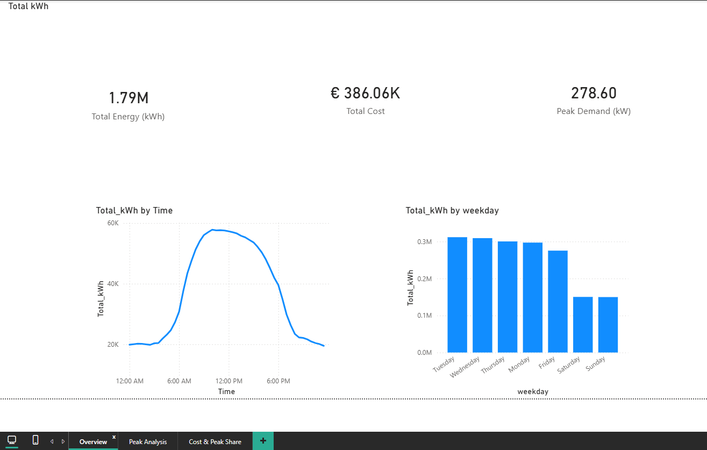
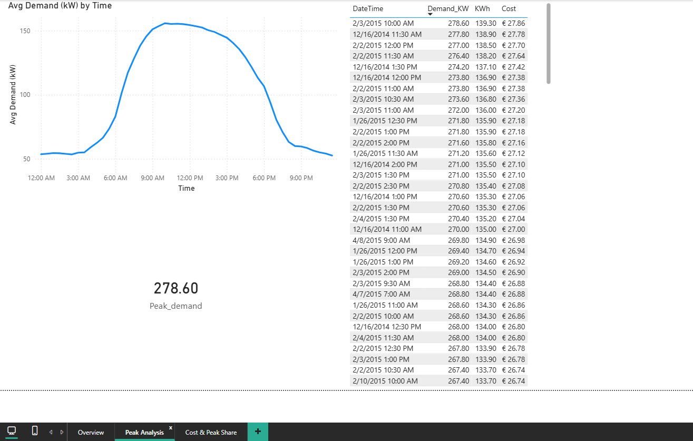
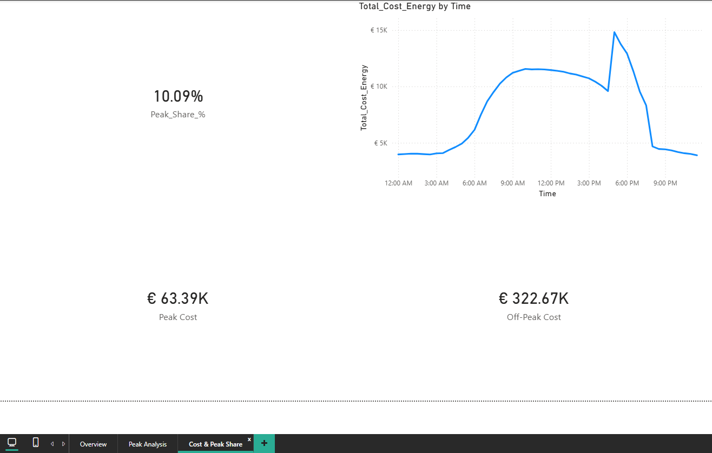

# energy-usage-cost-peak-dashboard
Dataset: https://docs.google.com/spreadsheets/d/1ENSwkupJiKwue0W6b_ocYVYIpDXE-2qJ/edit?usp=sharing&ouid=102799246209101915971&rtpof=true&sd=true
## Key insights (from the dashboard)

- **Peak-share is 10.09%** of total energy use (peak window is short), but it still matters because peak pricing is higher.
- **Peak demand reached 278.6 kW**, showing short periods of high load (capacity / peak-demand risk).
- **Peak vs off-peak cost:** **€63.39K** (peak) vs **€322.67K** (off-peak). Even with a small peak-share, peak hours contribute meaningful cost due to the higher tariff.
## Dashboard screenshots

### Overview

### Peak analysis

### Cost & Peak Share

